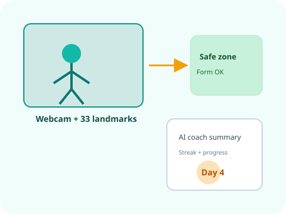

# Restora Coach

An in-browser AI physio that watches your recovery exercises, fixes your form, and keeps you coming back.



We built Restora Coach for people doing home rehabilitation after injury or surgery, and for older adults working on balance to prevent falls. Up to 70% of patients stop their home exercise program. They get a paper sheet, practice alone, and never know if their form is safe. Generic fitness rep counters do not help this group. We focus on short clinically shaped routines, real-time safety cues, and motivation that feels human.

## Quick demo (60 seconds)

1. Open the app and click **Get started**
2. Pick **Senior balance** or **Knee rehab**
3. Click **Start routine**, then **Start webcam** (HTTPS required)
4. Do a couple of reps and watch the safe-zone feedback turn green
5. Click **Finish session** to see the AI coach summary and streak update on **Progress**

## Features

- **Live form scoring** with MediaPipe 33-landmark pose tracking, skeleton overlay, and joint-angle targets
- **Prescribed mini-routines** (2 to 3 moves) for knee rehab, shoulder mobility, and senior balance
- **Safety guardrails** such as knee-over-toe warnings and out-of-range alerts
- **AI coach summaries** via Gemini 2.5 Flash (optional key) with warm fallback copy offline
- **Adherence streak and progress chart** with seeded history on first visit
- **Voice cues** via Web Speech API for hands-free coaching

## Tech stack

- Next.js 14 (App Router) + TypeScript + Tailwind CSS
- shadcn-style UI (Radix primitives)
- [@mediapipe/tasks-vision](https://ai.google.dev/edge/mediapipe/solutions/vision/pose_landmarker/web_js) (client-side)
- [Google Gemini API](https://aistudio.google.com/app/apikey) (optional, user-provided key)
- Recharts, localStorage persistence
- Docker standalone deployment

## Setup

```bash
npm install
npm run dev
```

Open [http://localhost:3000](http://localhost:3000). Webcam features require HTTPS in production (or localhost in dev).

### API keys (optional)

Go to **Settings** and paste a free [Google AI Studio](https://aistudio.google.com/app/apikey) key for live Gemini coach summaries. Keys are stored in `localStorage` only under `restora_api_keys`. Without a key, the app uses built-in encouragement text.

### Docker

```bash
docker build -t restora-coach .
docker run -p 3000:3000 restora-coach
```

## Architecture

```
Browser webcam
    -> MediaPipe Pose Landmarker (WASM, local)
    -> Smoothing + angle math + rep state machine
    -> Live UI feedback (safe / warn / risk)
    -> Session metrics in localStorage
    -> POST /api/coach with x-user-gemini-key header (optional)
    -> Complete screen + dashboard streak/chart
```

Pose video never uploads to our server. Only anonymized exercise metrics are sent when you request an AI summary.

## Research notes

Design choices follow findings on home PT adherence, supportive feedback, fall-prevention video programs, and browser pose estimation. See the in-app **Research** page for links.

## Disclaimer

Restora Coach is a supportive coaching aid, not medical advice, diagnosis, or a replacement for care from a licensed clinician.

## Credits

Built by **Aryan Choudhary** (aryancta@gmail.com) for the Health and Fitness Technology hackathon track.
